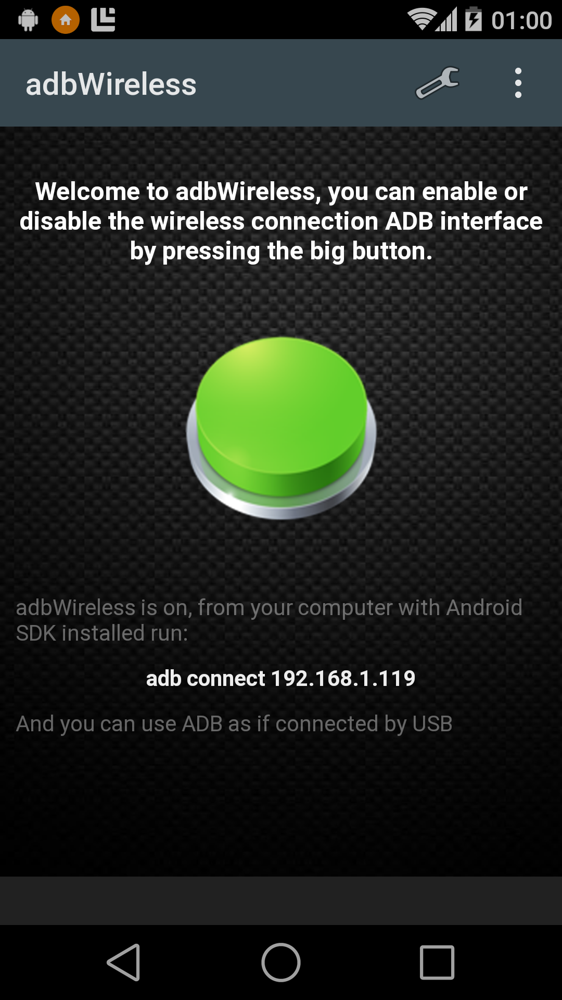
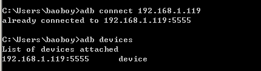

adb 无线调试，妈妈再也不用担心我的手机电池了
-  
有木有觉得每天真机调试的时候总插着数据线心情很不愉悦呢，日复一日，手机电池都搞挂了，要是能不插着数据线就能调试是一件多么美好的事情。  

好啦，插着数据线调试的日子到此结束了，推荐一个无线调试神器：adbWireless，这是个手机端的app，不过前提是要 root，这应该都不是事~

附上下载地址先

* [请不要怜悯你的鼠标猛戳此处下载apk](/files/adbWireless.apk)

如果你的鼠标没被猛戳坏的话，那就进入使用教程咯~  
  
* 手机上打开 adbWireless 并授予 root 权限
* 进入首页，看到中间有个圆按钮就猛戳上去
* 按钮变成绿色， 下面显示着手机的 ip地址
* 
* 
* 
* 在电脑 Command 中敲：adb connect ip
* 
* 

大功告成！ adb devices 一下看看有木有吧， 或者直接去 IDE 中查看， 然后就可以愉快的玩耍了，应用部署、log等统统无线搞定。